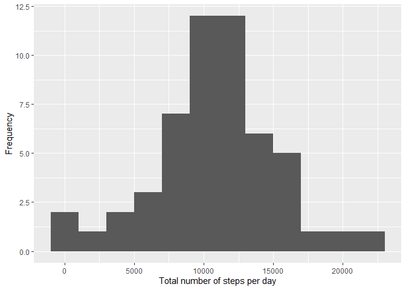
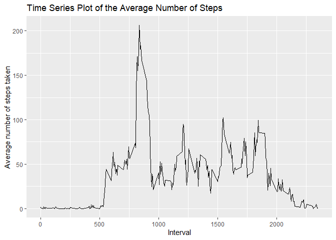
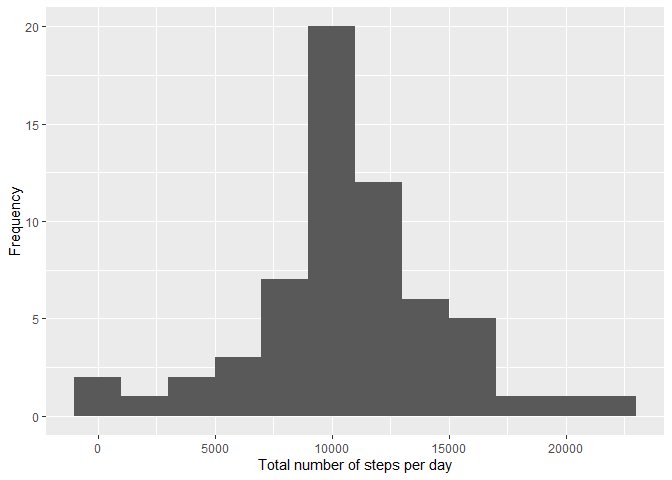
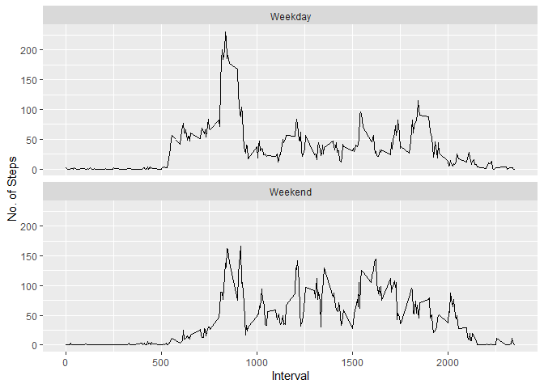

```r
library(ggplot2)
library(dplyr)
```

```
## 
## Attaching package: 'dplyr'
```

```
## The following objects are masked from 'package:stats':
## 
##     filter, lag
```

```
## The following objects are masked from 'package:base':
## 
##     intersect, setdiff, setequal, union
```

```r
library(lubridate)
```

```
## 
## Attaching package: 'lubridate'
```

```
## The following objects are masked from 'package:base':
## 
##     date, intersect, setdiff, union
```

```r
options(dplyr.summarise.inform = FALSE)
```
## Loading and preprocessing the data


```r
url <- "https://d396qusza40orc.cloudfront.net/repdata%2Fdata%2Factivity.zip"
download.file(url, destfile = paste0(getwd(), '/repdata%2Fdata%2Factivity.zip'))
unzip("repdata%2Fdata%2Factivity.zip")

activity <- read.csv('activity.csv')
head(activity)
```

```
##   steps       date interval
## 1    NA 2012-10-01        0
## 2    NA 2012-10-01        5
## 3    NA 2012-10-01       10
## 4    NA 2012-10-01       15
## 5    NA 2012-10-01       20
## 6    NA 2012-10-01       25
```


Doing some exploratory analysis


```r
dim(activity)
```

```
## [1] 17568     3
```

```r
summary(activity)
```

```
##      steps            date              interval     
##  Min.   :  0.00   Length:17568       Min.   :   0.0  
##  1st Qu.:  0.00   Class :character   1st Qu.: 588.8  
##  Median :  0.00   Mode  :character   Median :1177.5  
##  Mean   : 37.38                      Mean   :1177.5  
##  3rd Qu.: 12.00                      3rd Qu.:1766.2  
##  Max.   :806.00                      Max.   :2355.0  
##  NA's   :2304
```

```r
str(activity)
```

```
## 'data.frame':	17568 obs. of  3 variables:
##  $ steps   : int  NA NA NA NA NA NA NA NA NA NA ...
##  $ date    : chr  "2012-10-01" "2012-10-01" "2012-10-01" "2012-10-01" ...
##  $ interval: int  0 5 10 15 20 25 30 35 40 45 ...
```


## What is mean total number of steps taken per day?

### The Total number of steps taken per day


```r
totalsteps <- aggregate(steps~date, activity,sum)
totalsteps
```

```
##          date steps
## 1  2012-10-02   126
## 2  2012-10-03 11352
## 3  2012-10-04 12116
## 4  2012-10-05 13294
## 5  2012-10-06 15420
## 6  2012-10-07 11015
## 7  2012-10-09 12811
## 8  2012-10-10  9900
## 9  2012-10-11 10304
## 10 2012-10-12 17382
## 11 2012-10-13 12426
## 12 2012-10-14 15098
## 13 2012-10-15 10139
## 14 2012-10-16 15084
## 15 2012-10-17 13452
## 16 2012-10-18 10056
## 17 2012-10-19 11829
## 18 2012-10-20 10395
## 19 2012-10-21  8821
## 20 2012-10-22 13460
## 21 2012-10-23  8918
## 22 2012-10-24  8355
## 23 2012-10-25  2492
## 24 2012-10-26  6778
## 25 2012-10-27 10119
## 26 2012-10-28 11458
## 27 2012-10-29  5018
## 28 2012-10-30  9819
## 29 2012-10-31 15414
## 30 2012-11-02 10600
## 31 2012-11-03 10571
## 32 2012-11-05 10439
## 33 2012-11-06  8334
## 34 2012-11-07 12883
## 35 2012-11-08  3219
## 36 2012-11-11 12608
## 37 2012-11-12 10765
## 38 2012-11-13  7336
## 39 2012-11-15    41
## 40 2012-11-16  5441
## 41 2012-11-17 14339
## 42 2012-11-18 15110
## 43 2012-11-19  8841
## 44 2012-11-20  4472
## 45 2012-11-21 12787
## 46 2012-11-22 20427
## 47 2012-11-23 21194
## 48 2012-11-24 14478
## 49 2012-11-25 11834
## 50 2012-11-26 11162
## 51 2012-11-27 13646
## 52 2012-11-28 10183
## 53 2012-11-29  7047
```

### A Histogram of the total number of steps taken each day

```r
ggplot(totalsteps, aes(x = steps)) + geom_histogram(binwidth = 2000) + xlab("Total number of steps per day") + ylab("Frequency")
```

<!-- -->


```r
mean = mean(totalsteps$steps, na.rm = TRUE)
median = median(totalsteps$steps, na.rm = TRUE)
mean
```

```
## [1] 10766.19
```

```r
median
```

```
## [1] 10765
```

The mean and median are as follows respectively:

    1. 10766.19
    2. 10765

## What is the average daily activity pattern?

### Time series plot of the average number of steps taken


```r
rm(mean)
avsteps <- aggregate(steps~interval, activity, mean)

ggplot(data=avsteps, aes(x=interval, y=steps)) +
  geom_line() +
  ggtitle("Time Series Plot of the Average Number of Steps") +
  xlab("Interval") + 
  ylab("Average number of steps taken")
```

<!-- -->

```r
  theme(plot.title = element_text(hjust = 0.5))
```

```
## List of 1
##  $ plot.title:List of 11
##   ..$ family       : NULL
##   ..$ face         : NULL
##   ..$ colour       : NULL
##   ..$ size         : NULL
##   ..$ hjust        : num 0.5
##   ..$ vjust        : NULL
##   ..$ angle        : NULL
##   ..$ lineheight   : NULL
##   ..$ margin       : NULL
##   ..$ debug        : NULL
##   ..$ inherit.blank: logi FALSE
##   ..- attr(*, "class")= chr [1:2] "element_text" "element"
##  - attr(*, "class")= chr [1:2] "theme" "gg"
##  - attr(*, "complete")= logi FALSE
##  - attr(*, "validate")= logi TRUE
```


```r
highest_steps =avsteps %>% filter(steps == max(steps))
```

## Imputing missing values


```r
missing <- sum(!complete.cases(activity))
```


```r
data_impute <- activity %>%
  mutate(
    steps = case_when(
      is.na(steps) ~ avsteps$steps[match(activity$interval, avsteps$interval)],      
      TRUE ~ as.numeric(steps)
    ))
```


## A Histogram of the total number of steps taken each day after missing values are imputed


```r
total_steps <- data_impute %>% group_by(date) %>% summarise(daily_steps = sum(steps))

ggplot(total_steps, aes(daily_steps)) + 
  geom_histogram(binwidth = 2000) + 
  xlab("Total number of steps per day") + 
  ylab("Frequency")
```

<!-- -->

## Are there differences in activity patterns between weekdays and weekends?

### Creating a new factor variable in the dataset with two levels - "Weekday" and "Weekend".


```r
day_of_week <- data_impute %>%
  mutate(
    date = ymd(date),
    weekday_or_weekend = case_when(wday(date) %in% 2:6 ~ "Weekday",
                                   wday(date) %in% c(1,7) ~ "Weekend")
  ) %>% select(-date) %>%
  group_by(interval, weekday_or_weekend) %>%
  summarise(
    steps = mean(steps)
  )
```


### Panel plot comparing the average number of steps taken per 5-minute interval across weekdays and weekends.

```r
ggplot(day_of_week, aes(interval, steps)) + 
  geom_line() + 
  facet_wrap(~weekday_or_weekend, nrow = 2) +
  xlab("Interval") + 
  ylab("No. of Steps")
```

<!-- -->
